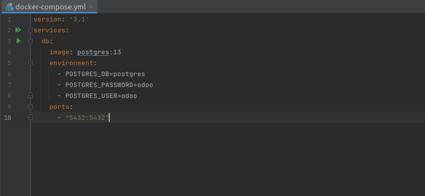
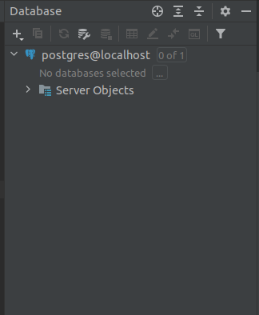
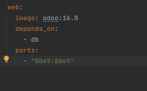

# odoo

###  Crear el docker-compose y descargar la imagen
### Lo meti en la base de datos postgres con el usuario odoo y la contraseña que yo ponga
### Y puse el puerto que queria para el docker-compose

### Para lanzar el docker-compose puse en la terminal: docker-compose up
### Ya corriendo el docker-compose cree una base de datos postgresSQL y me conecto con el usuario odoo y su contraseña respectiva

### implemento el servicio web en el docker compose
